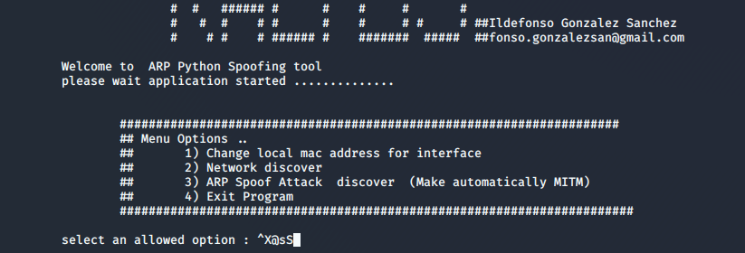
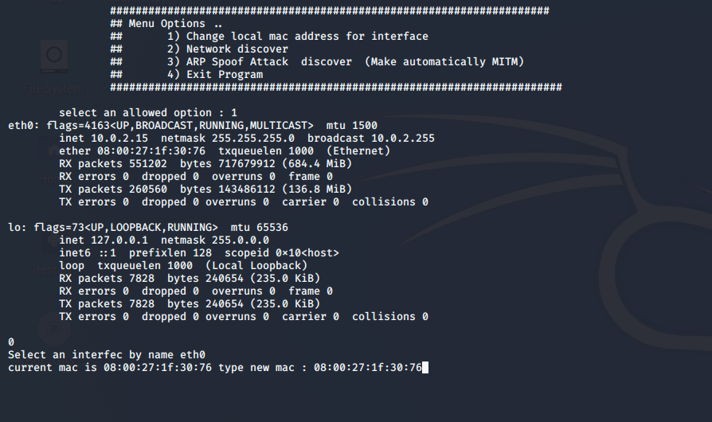
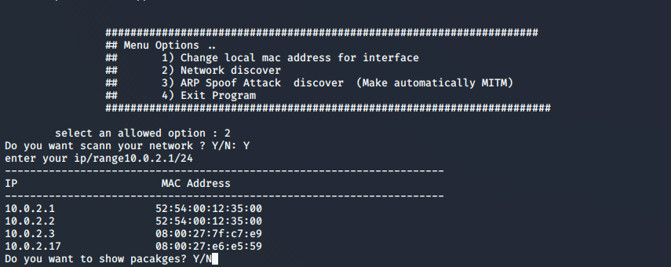
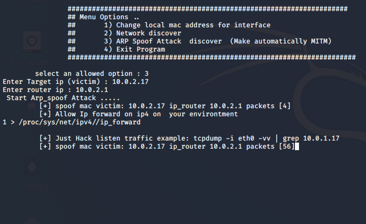
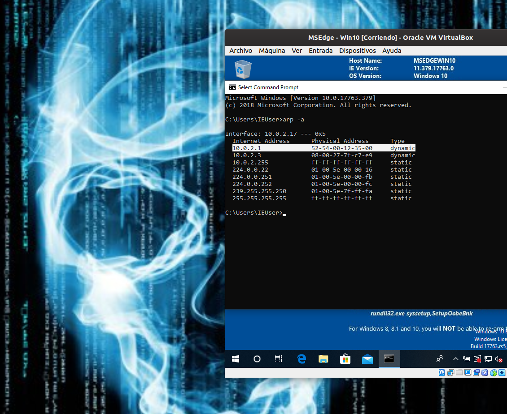
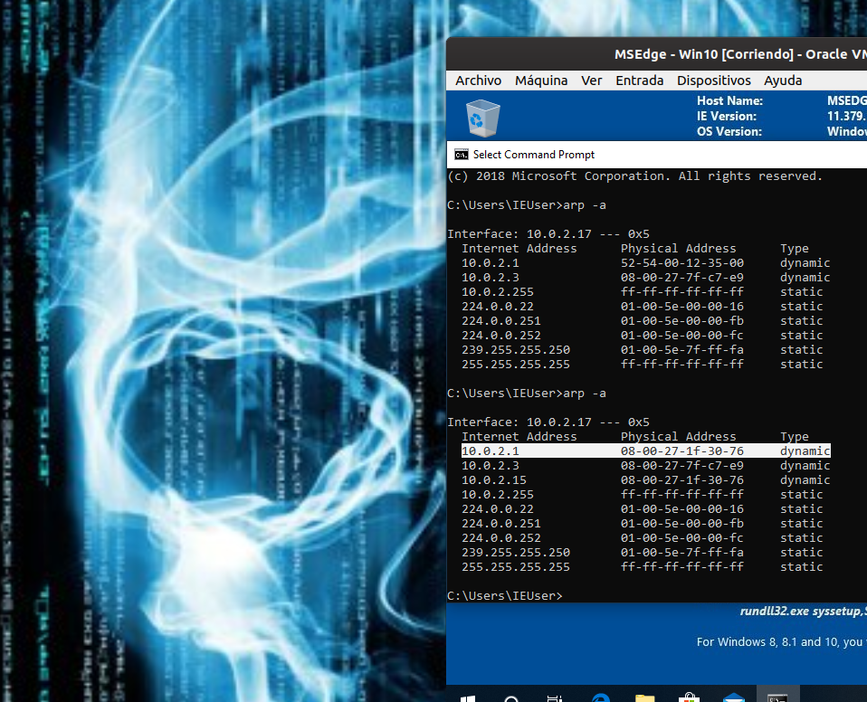
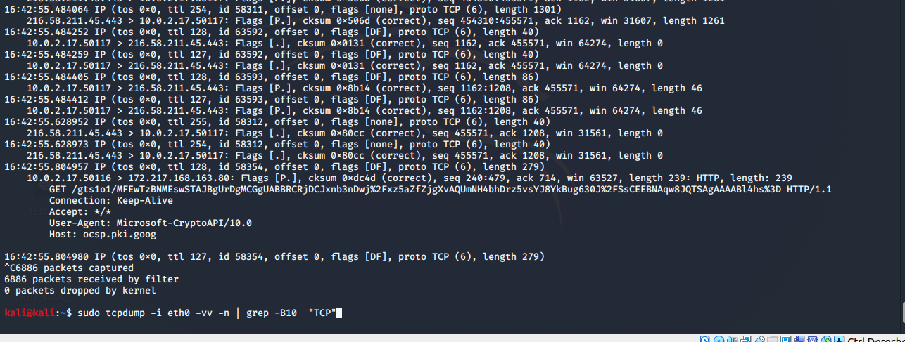

# evilHackingPythonTool

This is a tool of Hacking with Python using Kali Linux Operative system.
The first version of the tool is develop on Python 2.7, but with a little changes couldb be run with python 3.x

This version allow the following operations:

    1. Network Discovering using ARP
    2. Changing interface mac
    3. ARP Spoofing that automatically make a MitM  between the selected target ips,(ould be the victim and local royter)

This tool is develop for testing purposes feel free to use it ....

## Run application
  python arp_spoof.py

## Dependencies

    scapy
    subprocess
    re
    sys

## Init tool:

## Menu Options:

interactive menu interface 

## Change mac address:

operation that allow choose the local interface and new mac address for our "game"

## Network Discover:

That operation discover the network actives and connected to our network, for example we can use a subnetting range :
10.0.2.1/24 (for 256 host)

## ARP Spoof Attack

Make automatycally an arp spoofing attack with two devices at the same time:

    -victim : targeted_ip
    -router : soruce_ip 

The tool spoof OS mac address to targeted_ip insetad of source_ip mac address conutinuosly. And make the same process with the source_ip.

** in addition allow automatically change OS ip_forwarding in order to enable the pass throug information from the victim to router

victim initial mac address of router:

victim mac address during attack:

Capture traffic example that verify our attack:

